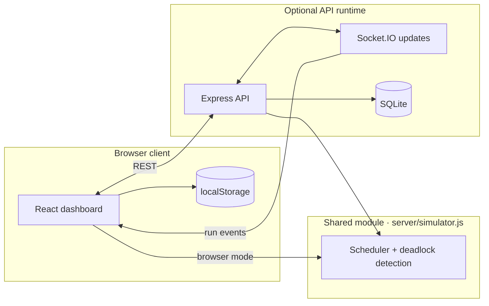
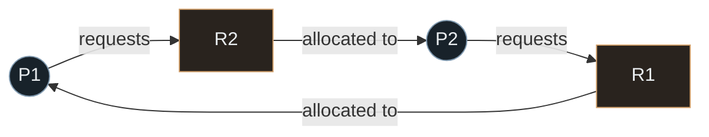

# Deadlock Runtime Lab

### A resource-allocation graph you can run, inspect, and recover.

Build operating-systems scenarios and watch a deterministic virtual scheduler expose resource contention and deadlocks. This project simulates processes; it does not inspect or control processes on your machine.

<p>
  
  
  
  
  
</p>

[Launch the app](https://deepak17kb.github.io/Automated-Deadlock-Detection-Tool/) · [Quick start](#quick-start) · [Architecture](#architecture) · [Model](#simulation-model)

## At a Glance

- **Configure:** compose processes, single-instance resources, allocations, and requests, or start from a built-in scenario.
- **Observe:** inspect CPU scheduling, process state, resource ownership, wait queues, and the event trace as virtual time advances.
- **Explore:** select graph nodes to trace dependencies; zoom, inspect edge direction, and see requests animate through the graph.
- **Recover:** choose a deadlocked process to terminate, release its resources, and continue the run.
- **Run anywhere:** use the local SQLite-backed API or browser-only mode with device-local storage.

## Architecture

The simulator module is shared by the API runtime and the browser fallback. The API is optional for running the simulation, but provides durable local history and live server updates.



```text
src/App.jsx  ── UI, controls, graph, run-mode selection
	  │
	  ├── src/localStore.js ── browser drafts, scenarios, run history
	  ├── src/api.js        ── REST + Socket.IO client
	  │
	  └── server/simulator.js ── model validation, scheduler, deadlock detection
					│
					├── server/index.js    ── Express + Socket.IO
					└── server/database.js ── SQLite persistence
```

## Quick Start

Use Node.js `24.14.0`, pinned in `.node-version`. Vite 7 requires Node.js `20.19+` or `22.12+`.

```powershell
npm ci
npm run dev
```

Open the Vite URL printed in the terminal, normally `http://localhost:5173`. The development API listens on `http://localhost:3001`.

1. Load **Classic deadlock**, **Dining philosophers**, or **Safe completion**, or build a system in the setup panel.
2. Add allocation edges from resource to process and request edges from process to resource.
3. Start the run. Pause, step, reset, or change the tick speed while watching the dashboard update.
4. Select a process or resource in the graph to inspect its connections. Use the zoom controls to change the view.
5. Resolve a detected cycle by terminating one of its processes; the freed resources can unblock the remaining work.

## Deadlock Graph

An allocation edge points **resource → process**. A request edge points **process → resource**. The classic preset forms this alternating cycle:



The runtime derives a wait-for graph from resource ownership and outstanding requests, then finds strongly connected components. A cycle represents processes waiting on one another. Recovery is explicit process termination; this is not Banker's Algorithm or a model of arbitrary operating-system policies.

## Simulation Model

- One virtual CPU core; scheduler time advances in discrete ticks.
- One exclusive instance per resource, with at most one holder.
- Deterministic CPU bursts; each process issues its configured requests in order.
- Held resources are released when a process exits or is selected for deadlock recovery.
- Completed runs and recent history are available to inspect or restore.

## Run Modes and Storage

At startup the app checks whether the API is reachable.

- **Local API:** Express and Socket.IO wrap the shared simulator; SQLite persists scenarios and run history at `data/deadlock-lab.sqlite`.
- **Browser fallback:** the same simulator runs in the browser; drafts, scenarios, and runs use `localStorage`.
- **Static deployment:** GitHub Pages and static Vercel use browser mode; neither runs the API or SQLite.

Browser data is scoped to the current profile. It does not sync between devices and is not a backup. Configure the local server with `PORT`, `HOST`, and `SIM_TICK_MS`; the default bind address is `127.0.0.1`.

## Development

```powershell
npm test          # Node test runner
npm run build     # production frontend in dist/
npm start         # serve production frontend + API on port 3001
```

`npm start` expects a production build first. The GitHub Pages workflow runs `npm ci` and `npm run build` on pushes to `main` and manual dispatches. Pages is static hosting: it does not run Express, Socket.IO, or SQLite. Enable **Settings → Pages → Build and deployment → GitHub Actions** to publish.

## Configuration

- `PORT`: HTTP API port; defaults to `3001`.
- `HOST`: bind address; defaults to `127.0.0.1`.
- `SIM_TICK_MS`: server simulation tick interval; uses the server default when unset.

## Security Note

The API has no user authentication. Do not expose it or sensitive scenario data publicly without adding an access-control layer. The simulator only models virtual processes; it never signals or terminates OS processes.
